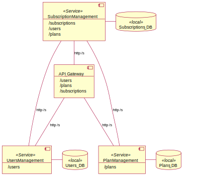

# Subscription_Management_API

An academic level 3 RestFull API to manage subscriptions much like Spotify.

### Contributors

This project was develop together with Sara Borges and Simão Gomes.

## Architecture

The project is designed following a microservice style approach, splitting services by domain concepts as well as responsibility concerns.

## Security

We implement Passport Login with JWT authentication that sends user roles along with further requests. Back-end services then check if the user has any of the allowed ones.

## Scalability

We are not yet implementing scalability in our system, although since our implementation follows a micro-service-like architecture, one way to achieve it it’s by using, for example, a combination of Docker + Kubernetes

## HTTP Verbs

We used the HTTP verbs according to REST Principles:

-   GET – Get resource info
-   PUT – Creates/updates resource
-   PATCH – Partially updates resource
-   DELETE – Delete resource
-   POST – Resource actions i.e. login + adds resource to collection

## HTTP Response Codes

We used different HTTP codes as response:

-   200 OK
-   201 CREATED
-   400 BAD REQUEST
-   401 UNAUTHORIZED
-   403 FORBIDDEN
-   404 NOT FOUND
-   405 NOT ALLOWED
-   409 CONFLICT
-   412 PRECONDITION FAILED
-   500 INTERNAL SERVER ERROR

## Caching

We implement cache in our system with the library node-cache. Each item saved in the cache has a time-to-live parameter that must be refined to both improve system performance and not miss data changes in external services.

## Other features

The API supports concurrent access, pagination, filtering, hypermedia, synchronous/asynchronous requests (i.e. callback url)

# How to Run

-   Download Repository
-   Open with editor of choice (i.e. vs code)
-   Install dependencies on each service with **npm install**
-   Create **.env** file and paste content of **.env.sample** file
-   Start each service with **npm start** (Optionally you could use **npm run dev** to run the projects with **nodemon**)

## Users and passwords

-   Admin/admin
-   Mario/111
-   Sara/abc

## Open API

[Swagger API Docs](http://localhost:3000/api-docs/)
