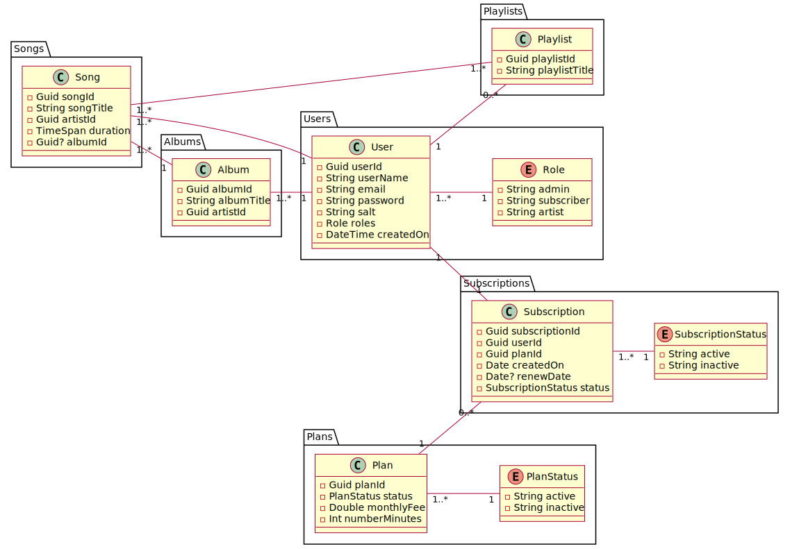
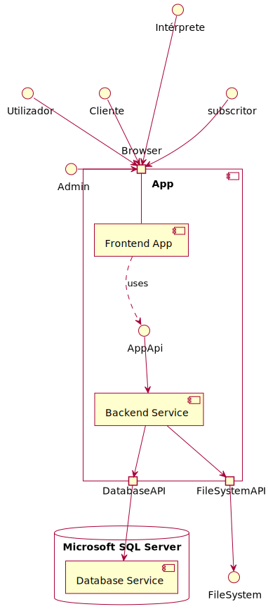

# Subscription_Management_API

An academic RestFull API to manage subscriptions much like Spotify.
The project is divided into two main parts: the frontend, which provides the user interface, and the backend, which processes requests and manages the database. The goal is to offer an intuitive and effective application with SSDLC Implementation, Testing and Deployment steps.

### Contributors

This project was develop by Davide Clemente, Sara Borges, Beatriz Borges and Simão Gomes.

## Architecture

Domain Model:

Monolithic Diagram:

## Features
- **Plan Visualization**: Access to the different plans available on the platform.
- **Plan Subscription:** Allows users to subscribe their plans.
- **Music and Playlist Management:** Create and manage playlists and music.
- **Music Upload:** Artists can upload and manage their music on the platform.
- **Administration:** Tools for plan and user management for administrators.

## Technologies Used
- **Frontend**: Angular
- **Backend**: .NET Core
- **Database**: Microsoft SQL Server
- **Containerization**: Docker

## Security
Security is a priority in our application. We have implemented various measures to ensure the protection of data and user privacy:
- **Authentication and Authorization**: We use JWT (JSON Web Tokens) to authenticate and authorize users, ensuring that only authorized users have access to protected resources. As well as aplying strong credential storage policies.
- **Data Encryption**: All sensitive data is encrypted.
- **Protection Against CSRF and XSS Attacks**: We have implemented measures to protect against Cross-Site Request Forgery (CSRF) and Cross-Site Scripting (XSS) attacks, ensuring the integrity of interactions with the application.
- **Monitoring and Logging**: The application is actively monitored, and detailed logs as well as efective error handling are maintained to detect and respond quickly to any suspicious activities or security breaches.

## HTTP Verbs

We used the HTTP verbs according to REST Principles:

-   GET – Get resource info
-   PATCH – Partially updates resource
-   POST – Resource actions i.e. login + adds resource to collection

## HTTP Response Codes

We used different HTTP codes as response:

-   200 OK
-   201 CREATED
-   400 BAD REQUEST
-   401 UNAUTHORIZED
-   403 FORBIDDEN
-   404 NOT FOUND
-   405 NOT ALLOWED
-   409 CONFLICT
-   412 PRECONDITION FAILED
-   500 INTERNAL SERVER ERROR

  
# Installation

## Prerequisites
- Node.js
- .NET Core SDK
  
## How to Run
-   Download Repository
-   Open with editor of choice (i.e. vs code)
-   Install dependencies on frontend service (Client folder) with **npm install**
-   Start frontend service with **npm start**, and backend (Backend folder) with **dotnet run**

